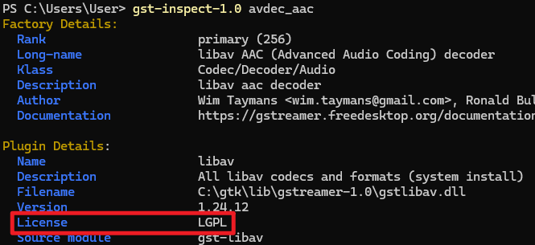

# 什麼是 GStreamer

和 FFmpeg 一樣, GStreamer 也是一個開源的多媒體框架。

但是 GStreamer 比 FFmpeg 更加強大，是由一個個的元件組成的，這些元件可以動態的組成一個管道。
這也使得在簡單需求下，GStreamer 可能會比 FFmpeg 更加複雜。(需要先建立管道)

但也因為這個特性，GStreamer 可以更加靈活的滿足複雜的需求。

GStreamer 也更容易以程式化的方式來編寫，因為 GStreamer 提供了一個完整的 GObject API。
可以從大多數流行的程式語言通過動態綁定中調用 GStreamer 的 API。
而不是從命令行調用。

## 使用案例

你只要用過 Ubuntu 或 Fedora 的桌面環境，就已經使用過 GStreamer 了。

GNOME 的桌面環境使用 GStreamer 來繪製畫面、播放音訊。[資料來源](https://en.wikipedia.org/wiki/GNOME#Development_platform)
也鼓勵 GNOME 應用程式使用 GNOME 應用的開發者使用 GStreamer。

## Plugin

## 開源協議

GStreamer 使用 LGPL 協議。
你可以在商業項目中使用 GStreamer，而不需要開源你的代碼。

需要注意的是 LGPL 協議似乎只允許 Dynamic Linking，不允許 Static Linking。
這個方案對於 Node.js 來說是沒有問題的，因為 Node-Gtk 是 Dynamic Linking 已經編譯好的 GStreamer 二進制文件。

GStreamer 各個插件的協議可能不同，需要注意。

可以通過 `gst-inspect-1.0 <GStreamer 元件>` 命令查看 GStreamer 插件的協議。

